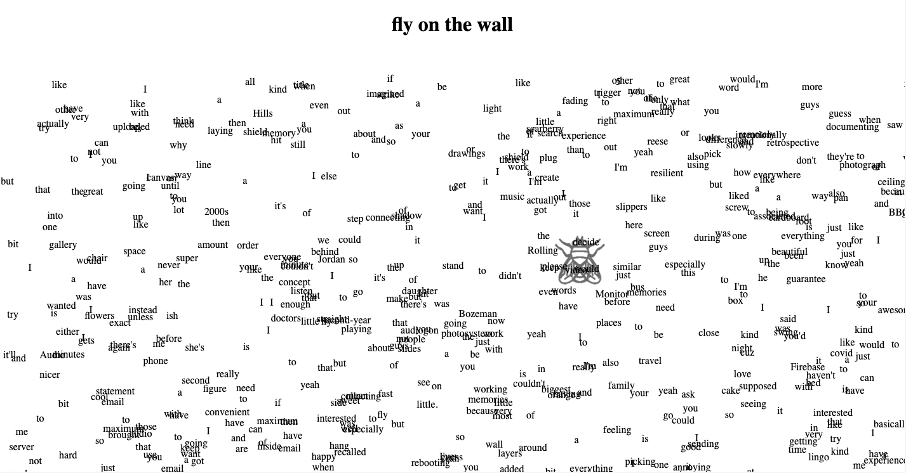

# fly-on-the-wall
discusses the idea that memories are always being created in realtime. The use of the phrase "a fly on the wall" and a fly trap symbolize how past conversations and memories can be misinterpreted or taken out of context over time. The fly catcher contains a recording device built with an Arduino that uploads words to a website using a python speech recognition library. The website is full of overheard words stored in a Firebase database. The words are also randomly scattered around the page, taking them out of context from their original phrases.

 
